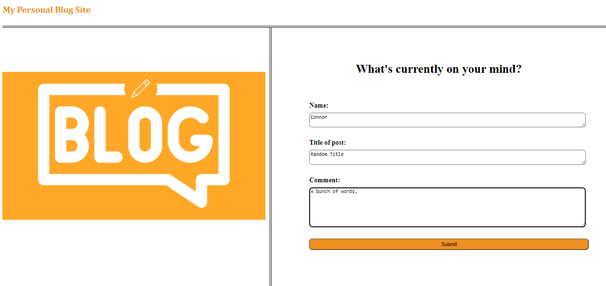
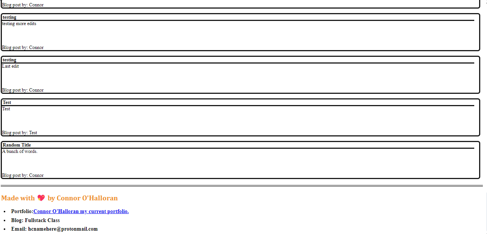
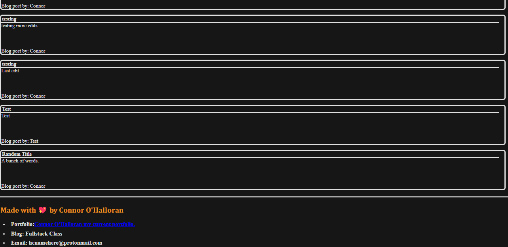

# Personal Blog Challenge4
My Blog Webite

## Description
A two page website for personal blog post, set up for use of anyone, records and keeps posted comments. titles of the blog, and names of the poster.

## Issues
No matter what I do I can not get the gitpages link to connect to the Blog Post Page, after filling in the information on the Main Page. The site works perfectly fine when opened from the Live Server in VSCode.

## Installation
No Installing required, just follow the deployment links.

## How to Use
1- Enter your username for log your name within the blog post, you can enter "anon/anonymously" if you choose to do so.

2- Enter the title of your blog post.

3- Fill in your blog post comments.

4- After all 3 boxes are filled, proceed by pressing Submit

5- You will then be brought to the collective blog post page where you can read through your/others previous blog post.

## Links
GitHub Repository Link: https://github.com/ConnorLuks/PersonalBlogChallenge4

Git Pages Link: https://connorluks.github.io/PersonalBlogChallenge4/

Only connects when opened via Live Server.
http://127.0.0.1:5500/index.html
http://127.0.0.1:5500/blog.html

## Site Screenshots
Main page

Blog post page Light Mode

Blog post page Dark Mode

## Credits
Connor O'Halloran